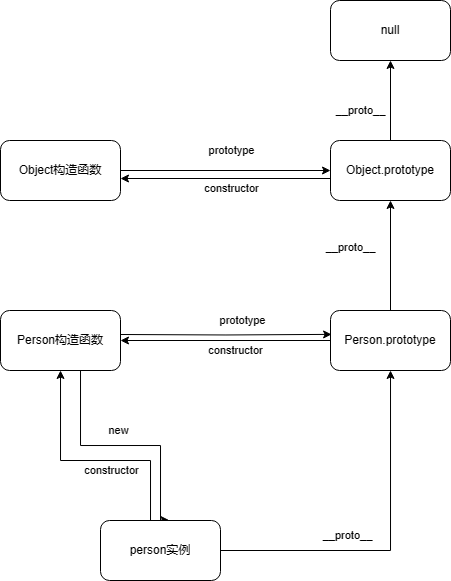

# 原型

## 原型对象

在JavaScript中利用`function`关键字创建的每一个函数都会有一个属性名为`prototype`的对象，而这个对象会有一个属性`constructor`，指向我们创建的函数本身。

而利用构造函数创建的实例对象默认会有一个`[[prototype]]`的属性指向原型对象，即构造函数的`prototype`。而且该实例对象也会有一个属性`constructor`，指向我构造函数本身。

> 在es5之前，在大部分浏览器中是通过实例对象的`__proto__`属性来访问`[[prototype]]`的，在es5之后可以利用`Object.getPrototypeOf()`来访问

## 原型对象的实践

在对象编程的实践中，通常我们会利用原型对象来定义对象的方法，例如

```javascript
function Person(name) {
    this.name = name
}
Person.prototype.sayName = function() {
    console.log(this.name)
}
```

这样我们利用`Person`创建的实例便可以访问到`sayName`方法

```javascript
var jack = new Person('Jack')
jack.sayName() // Jack
```

这样的好处是，当我们创建多个实例时，不用在构造函数里多次重复定义这些方法

## 原型链

参照上述，我们可以得知通过一个实例对象，能够通过它的`constructor`属性找到它的构造函数，也能够通过它的`[[prototype]]`来找到它的原型对象。同理，JavaScript中的对象类型，亦可通过`constructor`找到包装对象`Object`，通过`[[prototype]]`可以找到`Object.prototype`,里面定义了`__defineGetter__`、`__defineSetter__`等方法。

而对于实例对象而言，它会先找到它自己的实例的原型对象，才能继续找到包装对象`Object`，以上述的`person`实例举例。它的`[[prototype]]`会指向`Person.prototype`，然后`Person.prototype`的`[[prototype]]`会指向`Object.prototype`

```javascript
console.log(person.__proto__ === Person.prototype) // true
console.log(Person.prototype.__proto__ === Object.prototype) // true
```

最后，`Object.prototype`的`[[prototype]]`会指向`null`

```javascript
console.log(Object.prototype.__proto__ === null) // true
```

所以就形成了原型链：



## 继承对象

事实上，在面向对象编程中，我们经常会用到继承，关于继承在[另一篇文章](../extends)中讲述

## 参考文献

- [《JavaScript高级程序设计》](https://www.ituring.com.cn/book/2472)
https://developer.mozilla.org/zh-CN/docs/Learn/JavaScript/Objects/Object_prototypes